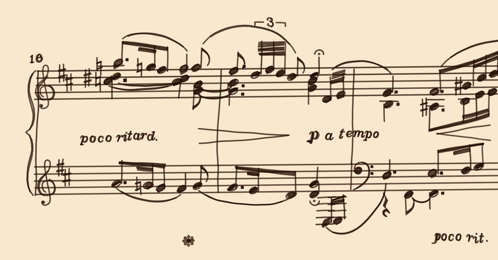
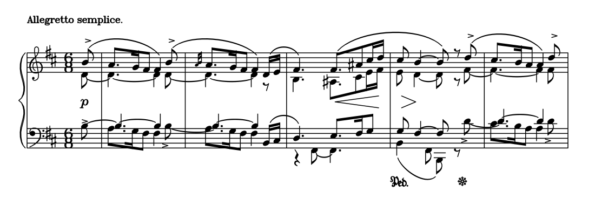
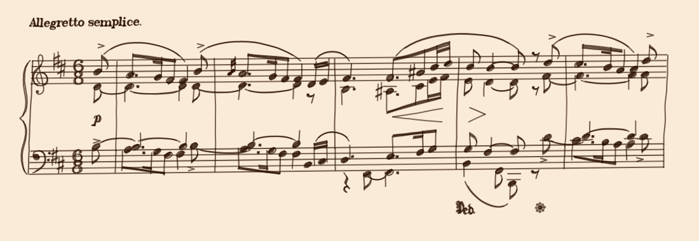
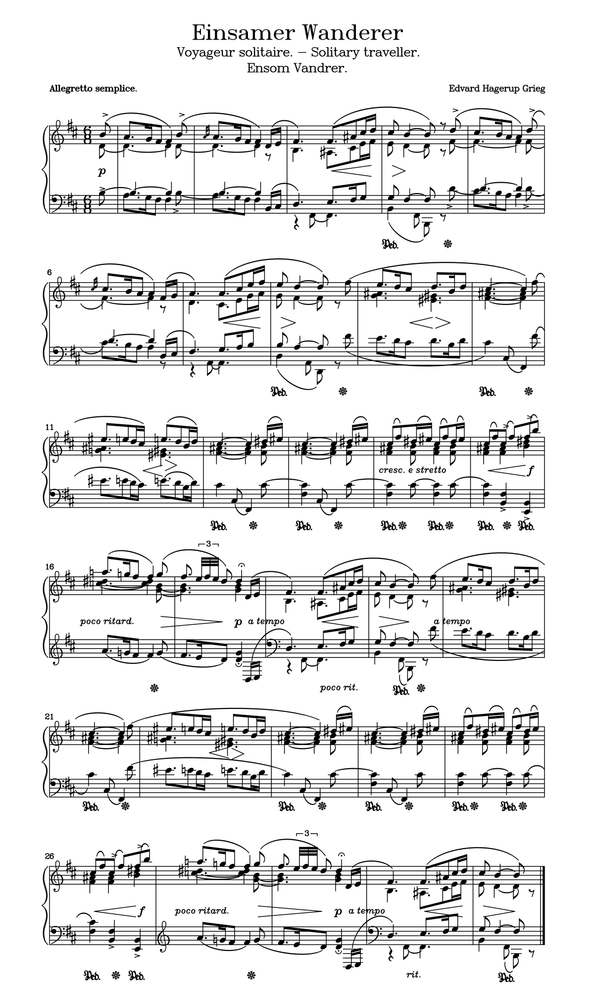

# legumes

🎼 *A sheet music to polylines renderer*

**[Samples](./samples) | [Online Editor](https://legumes.netlify.app/) | [API](API.md) | [Syntax](SYNTAX.md)**



In goes a midi file or a [simple markup format](SYNTAX.md), and out comes ✨polylines✨, which can then be used for animation, plotting and various procedural drawing fun.

> 🚧 This project is a work in progress and currently supports a subset of sheet music notation. Errors and ugliness might occur from time to time<sup>*</sup>. For professional quality scorewriting, check out https://en.wikipedia.org/wiki/List_of_scorewriters instead. 🚧

## Features

- Supports most everyday classical music symbols;
- Exports polylines, svg, pdf, gif, midi and more;
- Lightweight: < 150KB minified; No dependencies;
- Uses [Hershey Fonts](http://paulbourke.net/dataformats/hershey/) for text and symbols; You can load custom hershey fonts for rendering unicode etc;
- Includes basic animation and handdrawn effects generator;
- Use as browser/node.js library or commandline interface.

For examples, below are the first couple measures of Grieg's "Solitary Wanderer", typeset in legumes, with regular, animated and hand-drawn styles:





You can find at the bottom of this document the full score, or better yet,  **Checkout the [samples](./samples) folder** for a more comprehensive showcase featuring music by various composers!

<sub>*legumes is an acronym for *Lingdong's Erratic and Generally Useless Musical Engraving System*.</sub>

## Usage

The easiest way to try out the project is by using the [Online Editor](https://legumes.netlify.app/), which supports syntax highlighting and midi playback. For more advanced usage, there're commandline and programming interfaces, described below:

### Commandline

The [`legc` executable](./legc) included in the repo is a shebang'ed node.js script. You can easily invoke it in the commandline via `./legc` (or `legc` if placed/aliased in PATH) if you have node.js installed.

Minimal example, rendering a score to SVG:

```
legc --format svg samples/minuet_G.txt > output.svg
```

Another example, render a score to an animated svg, specifying some rendering options:

```
legc --format svg-anim \
  --stem-length 3 --title-text-size 28 --page-margin-x 120\
  samples/minuet_G.txt > output.svg
```

The commandline tool supports some 50+ rendering/export options, view the full list by typing:

```
legc --help
```

### Programming

Built JavaScript files acn be found in `dist/` folder. Import them via

```html
<script src="dist/legumes.min.js"></script>
```

or

```js
const legumes = require("dist/legumes");
```

You can find the full API doc [here](API.md), but here's a minimal example:

```js
const txt = fs.readFileSync("samples/minuet_G.txt").toString();

// build a score from the text-based markup
const score = legumes.parse_txt(txt);

// compile the score to pre-compute properties for drawing
legumes.compile_score(score);

// draw the score
let drawing = legumes.render_score(score);

// export drawing to SVG format
let svg = legumes.export_svg(drawing)

fs.writeFileSync("output.svg",svg);
// document.body.innerHTML = svg;
```

You can configure rendering options via the `CONFIG` object, e.g. :

```js
legumes.CONFIG.STEM_LENGTH = 3;
legumes.CONFIG.DURATION_BASED_SPACING = 0.07;
legumes.CONFIG.LYRIC_SCALE = 0.8;
```

Midi files can also be rendered, but note that midi is not a suitable format storing sheet music, and educated guesses has to be made converting it to one:

```js
let bytes_in = Array.from(new Uint8Array(fs.readFileSync("input.mid")));
let midi_file = legumes.parse_midi(bytes_in);
let score = legumes.score_from_midi(midi_file);
legumes.compile_score(score);
fs.writeFileSync("output.svg", legumes.export_svg(drawing));
```

What one could do, is read a midi file, and export it as markup text, make improvements by hand, and render the latter instead:

```js
let bytes_in = Array.from(new Uint8Array(fs.readFileSync("input.mid")));
let midi_file = legumes.parse_midi(bytes_in);
let score = legumes.score_from_midi(midi_file);
let txt = legumes.export_txt(score);
fs.writeFileSync("score.txt", txt);
```

In addition to the supported input file formats, you can construct your own score object to feed into legumes, as long as it conforms to the interface:

```ts
interface Score_itf{
  title:       string[];
  composer:    string[];
  tempo?:      Tempo_itf;
  instruments: Instrument_group_itf[];
  slurs:       Slur_itf[];
  measures:    Measure_itf[];
  crescs:      Cresc_itf[];
}
```
You can find more details about these interfaces in [API doc](API.md) and `src/common.ts`.




----

Special thanks to my friend [@jiangzoi](https://github.com/jiangzoi) (Computational music major at CMU) and my mother (piano teacher) for advice and help on sheet music, of which I came to realize I know little as I progress with the project.

Issues & Pull request are welcome.