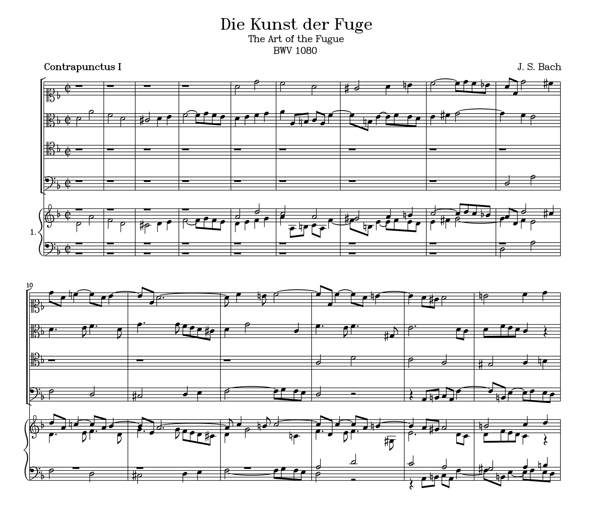
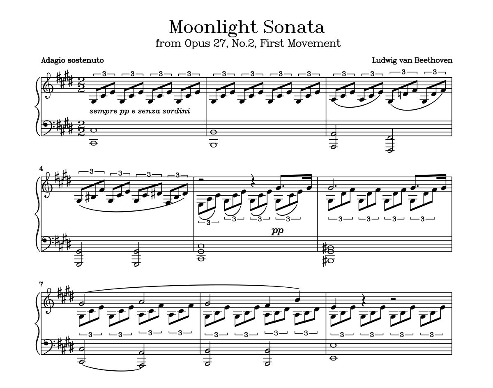
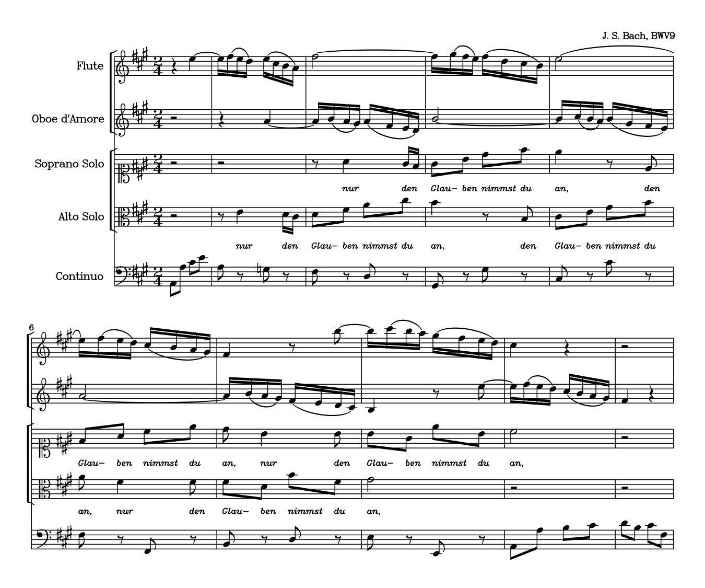
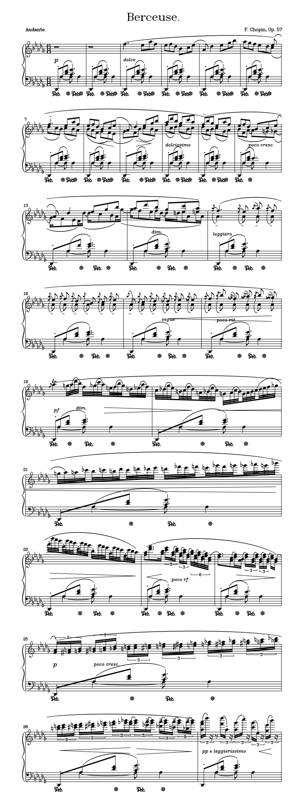
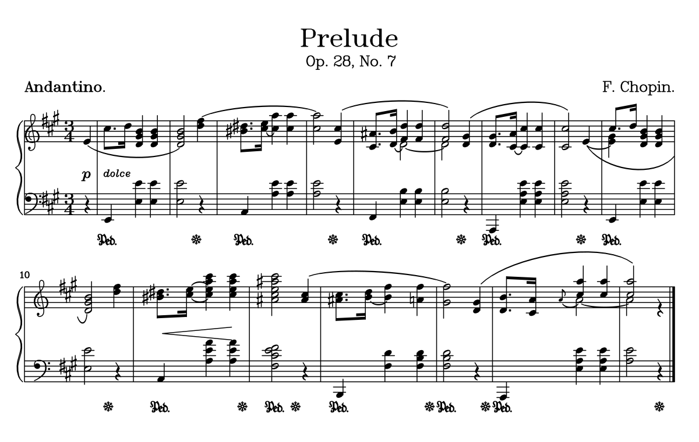
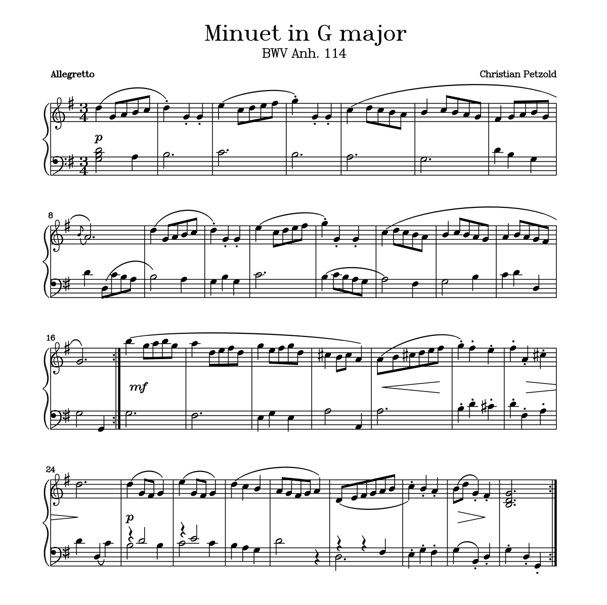
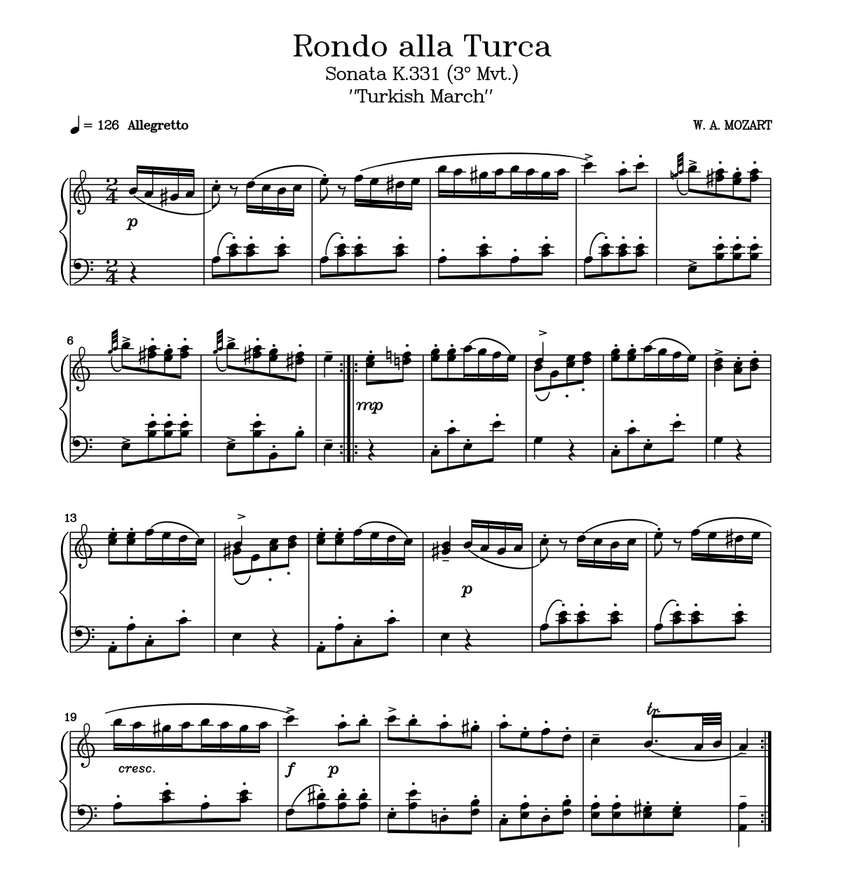
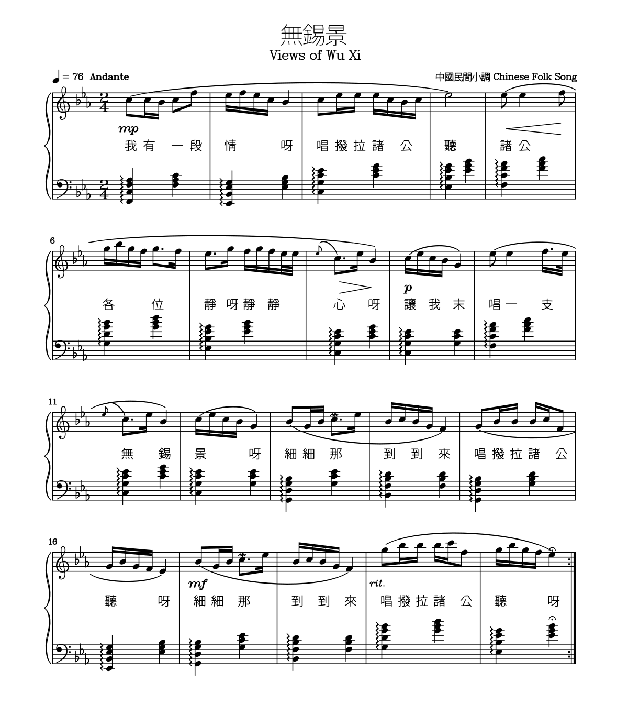
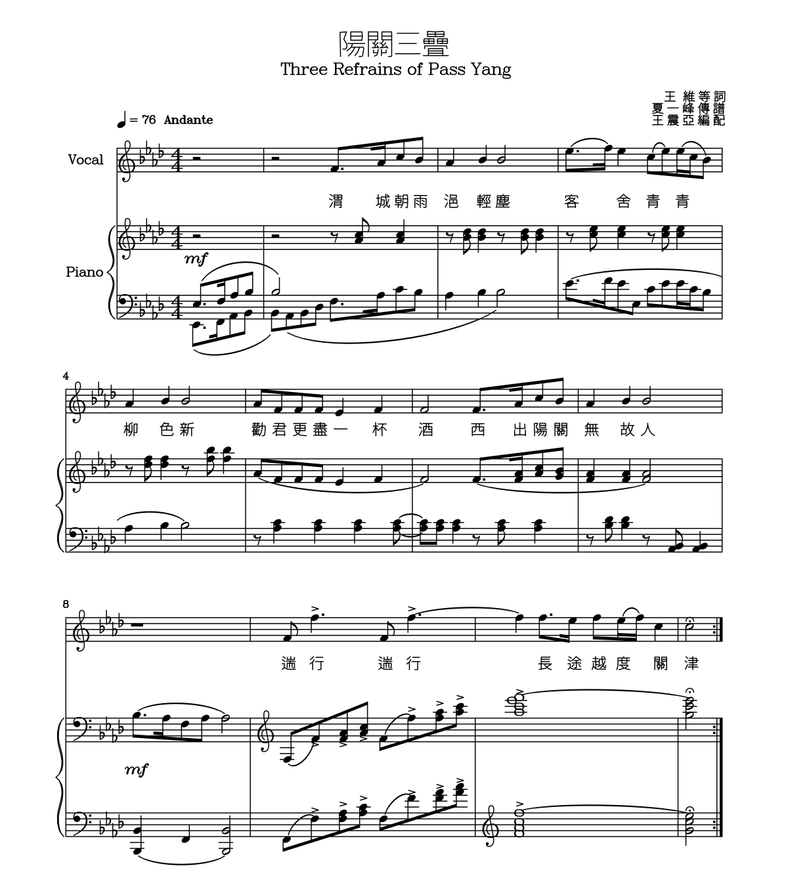

# Samples
## [art_of_fugue.txt](art_of_fugue.txt)

**Regular | [Animated](art_of_fugue.anim.svg) | [Hand-drawn](art_of_fugue.hand.svg)**




```
legc --format $(FMT) art_of_fugue.txt --inter-staff-height 50 --page-width 1600 --page-margin-x 80 --duration-based-spacing 0.04 --tempo-composer-text-size 20 --timesig-common-time-c 1 > art_of_fugue.$(EXT)
```

---


## [auld_lang_syne.txt](auld_lang_syne.txt)

**Regular | [Animated](auld_lang_syne.anim.svg) | [Hand-drawn](auld_lang_syne.hand.svg)**


```
legc --format $(FMT) auld_lang_syne.txt --duration-based-spacing 0.1 --inter-row-height 80 > auld_lang_syne.$(EXT)
```

---


## [beethoven_moonlight.txt](beethoven_moonlight.txt)

**Regular | [Animated](beethoven_moonlight.anim.svg) | [Hand-drawn](beethoven_moonlight.hand.svg)**




```
legc --format $(FMT) beethoven_moonlight.txt --tuplet-label-spacing 1.7 > beethoven_moonlight.$(EXT)
```

---


## [bwv9_excerpt.txt](bwv9_excerpt.txt)

**Regular | [Animated](bwv9_excerpt.anim.svg) | [Hand-drawn](bwv9_excerpt.hand.svg)**




```
legc --format $(FMT) bwv9_excerpt.txt --inter-staff-height 50 --page-width 1350 --page-margin-x 60 --duration-based-spacing 0.00 --inter-note-width 5 --lyric-scale 0.5 --beam-policy 1 > bwv9_excerpt.$(EXT)
```

---


## [chopin_berceuse.txt](chopin_berceuse.txt)

**Regular | [Animated](chopin_berceuse.anim.svg) | [Hand-drawn](chopin_berceuse.hand.svg)**




```
legc --format $(FMT) chopin_berceuse.txt --inter-note-width 0 --tuplet-label-spacing 0.1 --inter-row-height 150 > chopin_berceuse.$(EXT)
```

---


## [chopin_prelude_7.txt](chopin_prelude_7.txt)

**Regular | [Animated](chopin_prelude_7.anim.svg) | [Hand-drawn](chopin_prelude_7.hand.svg)**




```
legc --format $(FMT) chopin_prelude_7.txt --stem-length 3 --page-margin-x 42 --tempo-composer-text-size 20 > chopin_prelude_7.$(EXT)
```

---


## [einsamer_wanderer.txt](einsamer_wanderer.txt)

**Regular | [Animated](einsamer_wanderer.anim.svg) | [Hand-drawn](einsamer_wanderer.hand.svg)**


```
legc --format $(FMT) einsamer_wanderer.txt --cue-height 0 --duration-based-spacing 0.01 --inter-note-width 2 --inter-row-height 140 > einsamer_wanderer.$(EXT)
```

---


## [minuet_G.txt](minuet_G.txt)

**Regular | [Animated](minuet_G.anim.svg) | [Hand-drawn](minuet_G.hand.svg)**




```
legc --format $(FMT) minuet_G.txt --stem-length 3 --inter-note-width 2 --duration-based-spacing 0.04 > minuet_G.$(EXT)
```

---


## [mozart_turkish_march.txt](mozart_turkish_march.txt)

**Regular | [Animated](mozart_turkish_march.anim.svg) | [Hand-drawn](mozart_turkish_march.hand.svg)**




```
legc --format $(FMT) mozart_turkish_march.txt --stem-length 3 --beam-max-slope 0.2 --cue-height 0 > mozart_turkish_march.$(EXT)
```

---


## [wu_xi_jing.txt](wu_xi_jing.txt)

**Regular | [Animated](wu_xi_jing.anim.svg) | [Hand-drawn](wu_xi_jing.hand.svg)**




```
legc --format $(FMT) wu_xi_jing.txt --font ../tools/chinese.hf.json --lyric-scale 0.75 --duration-based-spacing 0.075 --inter-note-width 5 --beam-policy 1 > wu_xi_jing.$(EXT)
```

---


## [yang_guan_san_die.txt](yang_guan_san_die.txt)

**Regular | [Animated](yang_guan_san_die.anim.svg) | [Hand-drawn](yang_guan_san_die.hand.svg)**




```
legc --format $(FMT) yang_guan_san_die.txt --font ../tools/chinese.hf.json --lyric-scale 0.72 --cue-height 5 > yang_guan_san_die.$(EXT)
```

---


